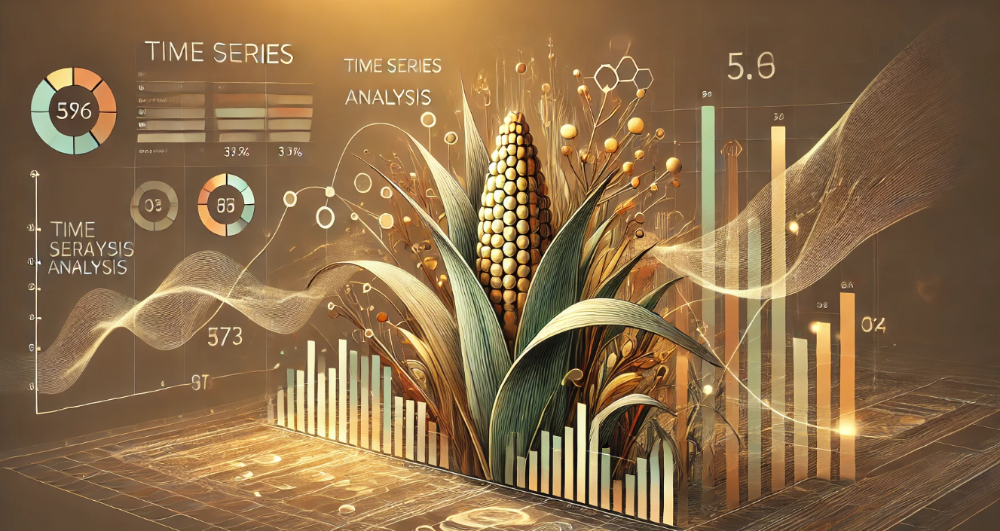

# 📌 Análisis Temporal de Exportaciones de Fertilizantes con XGBoost

[](https://www.python.org/) [](https://xgboost.ai/) [](https://streamlit.io/)

## 👥 Participantes
- **Kristhel Porras**
- **Carolina Salas**
---
## 🎯 Objetivo
Predecir los destinos de exportación de fertilizantes de Costa Rica utilizando análisis temporal con **XGBoost**. El proyecto busca identificar patrones y tendencias en las exportaciones de fertilizantes, aprovechando técnicas avanzadas de machine learning para una toma de decisiones más precisa.

---
## 📁 Estructura del Proyecto
```
📂 modules/                # Módulos del proyecto
│   ├── init.py        # Inicialización del paquete
│   ├── login.py           # Autenticación y control de acceso
│   ├── pipeline.py        # Procesamiento de datos y entrenamiento del modelo
│   ├── results.py         # Análisis y visualización de resultados
📂 data/                   # Almacenamiento de datos
│   ├── Fertilizantes_CR_En-Feb_2025.xlsx  # Dataset principal
│   ├── backup_data.csv    # Respaldo de datos
📂 config/                 # Configuraciones
│   └── config.json        # Parámetros de configuración del modelo
📄 app_control.py          # Script principal de control
📄 requirements.txt        # Dependencias del proyecto
📄 README.md               # Documentación del proyecto
```

---

## 🚀 Cómo Ejecutar el Proyecto
### 🔧 Instalación
```bash
# Crear entorno virtual
python -m venv venv
source venv/bin/activate  # En Windows: venv\Scripts\activate

# Instalar dependencias
pip install -r requirements.txt
```

### 📥 Carga y Procesamiento de Datos
```bash
python modules/pipeline.py   # Cargar y procesar datos
```

### 🎯 Entrenamiento del Modelo
```bash
python modules/pipeline.py   # Cargar y entrenar modelo
```

### 🌐 Ejecutar la Aplicación Web
```bash
streamlit run app_control.py   # Ejecutar la aplicación principal
```
Como nota tener en cuenta que el menú va a desplegar la opción de pipeline, en esa opción debe asegurarse seleccionar en la sección de transformación "Todas las columnas categóricas" y "Códigos categóricos" antes de seleccionar el botón de "Transformar todas la columnas".

---

## 📖 Tabla de Contenidos
1️⃣ [Código Fuente](https://github.com/CSMore/Admin-Datos-_ModeloPredictivo1)  
2️⃣ [Documentación Técnica](https://github.com/CSMore/Admin-Datos-_ModeloPredictivo1/blob/main/Trabajo%20en%20grupo%201%20-%20Documentaci%C3%B3n%20t%C3%A9cnica.docx)  
3️⃣ [Informe del Proyecto](#)

---
